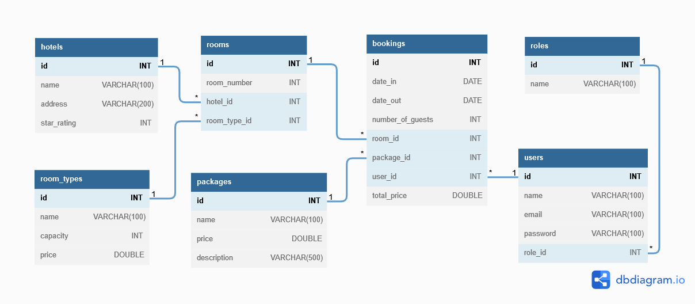
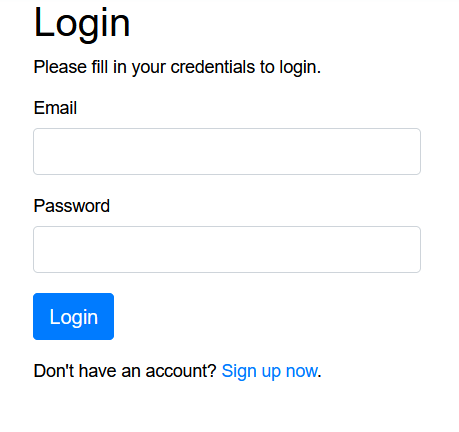
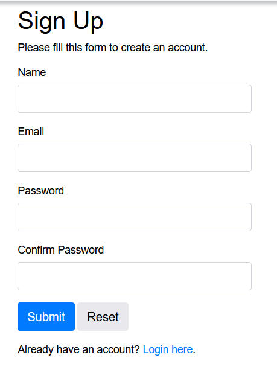

# Hotel-Reservation-Website(University Diploma Project)

A Hotel Reservation Website, where you can make reservation.

# Technologies 

- PHP
- HTML
- CSS
- JavaScript
- Bootstrap
- XAMPP
- MySQL

# Functionality 

 - Register
 - Sign in
 - Logout
 - Reset password
 - Search rooms by name
 - Make reservations
 - Admin account, which can make changes on the website(price,reservations)
 - Chose package you want
 
 
 # App setup
 
 To start the project, you need to have XAMMP, also you need to put code from hotel.db in localhost/phpmyadmin!!
 
 # Hotel Database
 
 </img>
 
 # Screenshots
 
 ## Login
 
 </img>
 
 ## Register
 
 </img>
 

